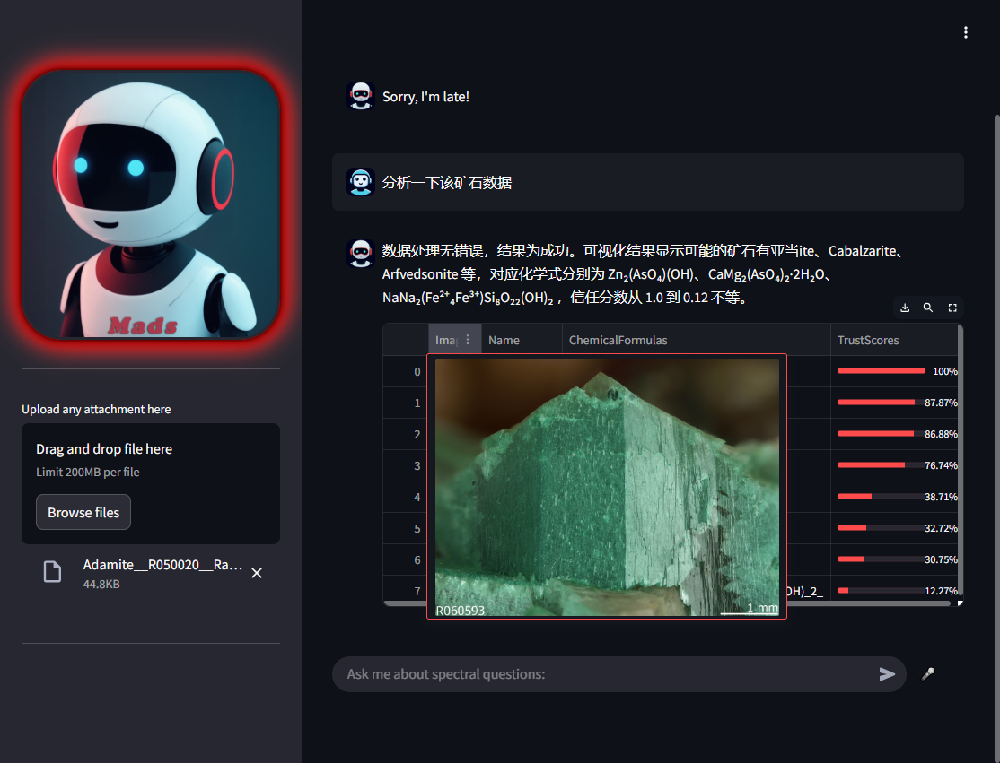
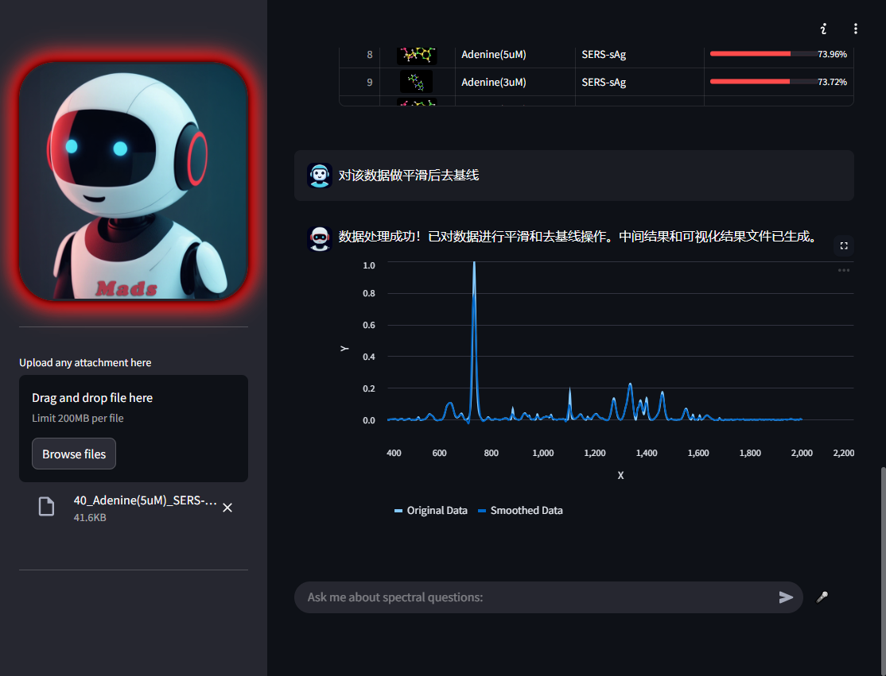
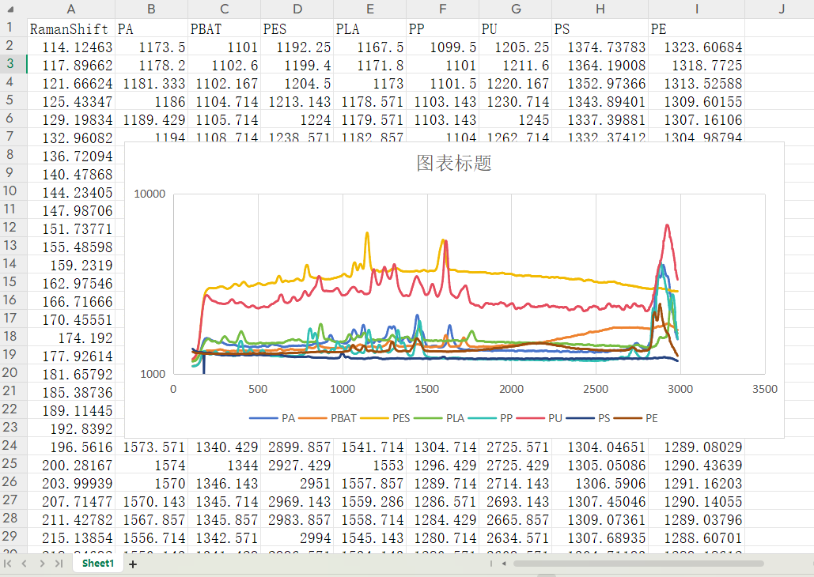

# spectralassistant

  

## Key Features

- [**Identifying the main component information of the substance**](#Component-identifying)
  - AI will become a "scientific detective" and help you identify the molecular structure of materials in one second, restoring the truth from the microscopic world that is invisible to the naked eye.
  - Whether it is experimental materials, daily necessities, or complex samples, spectral data can be used for intelligent analysis to quickly identify materials and make accurate judgments.
- [**Matching substance related database**](#Database-matching)
  - How to intelligently read, classify and model spectral data.
  - From material detection to environmental monitoring, how does AI accelerate the analysis process.
  - Create a unique "high-dimensional spectral knowledge base" to truly unlock the value of experimental data.
- [**Analysis of massive data**](#Analysis-of-massive-data)
  - Support multi-dimensional data fusion processing.
  - Quickly identify anomalies and patterns.
  - Output visual graphs and human language conclusions.
- [**Collaboration with Multi-agent**](#Multi-agent)
  - Apply colormap to polarization images, such as DoLP, AoLP, ToP, and CoP.
  - Visualize the Mueller matrix image in grid form.

## Dependencies and Installation

- Mcp
- Streamlit
- Python

## Usage

### Component identifying

Focusing on the application of optical spectroscopy technology in the field of ore composition analysis, this paper expounds its core principles, technical processes and application value. The combination of optical spectroscopy technology and AI algorithms provides efficient and accurate solutions for ore element detection and structural analysis, which is of great significance in geological research and resource development. ​

In the field of mineralogical research and resource exploration, accurate analysis of ore composition is the key to revealing the laws of geological evolution and developing mineral resources. Traditional analysis methods have problems such as low efficiency and insufficient precision, while optical spectroscopy technology has become the cutting-edge means of ore composition analysis with its non-destructive, fast and highly sensitive characteristics. ​

Optical spectroscopy technology mainly uses Fourier transform infrared spectrometers, X-ray fluorescence spectrometers and other equipment for analysis. When light interacts with ore samples, different elements and mineral structures have different absorption, emission and scattering characteristics of light, and these differences are presented in the form of spectral curves. After collecting spectral data, researchers input them into the AI ​​analysis system, compare them with standard spectra in the spectral database, and combine machine learning algorithms to achieve accurate analysis of ore element types, contents and crystal structures.​

This technology has achieved remarkable results in many fields. In geological evolution research, by analyzing the composition of ores, geological activities in the earth's history can be traced; in resource exploration, rare metal veins can be efficiently located to help strategic resource development; in the field of new material research and development, accurate composition analysis provides data support for the optimization of mineral material performance. The integration of optical analysis and AI technology has increased the efficiency of ore composition analysis by more than 60%, and the detection accuracy has reached the ppm level. ​

The combination of optical spectroscopy technology and AI algorithms has revolutionized the ore composition analysis mode. In the future, with the improvement of the spectral database and the continuous optimization of the algorithm, this technology will achieve breakthroughs in the analysis of complex mineral systems and in-situ real-time detection, providing stronger support for mineralogical research and sustainable resource utilization. ​.

<picture>
  
</picture>

### Database matching

In the context of the rapid development of artificial intelligence technology, the quality and scale of the database directly affect the analytical ability of the intelligent body. Building a multi-domain database and integrating interdisciplinary data resources can provide a comprehensive and accurate data foundation for the intelligent analysis of complex problems and meet the research and application needs of different fields. ​

Multi-domain database architecture and content​
(I) Mineral field database​
This database contains information on rare and common minerals, including precious minerals such as gold and diamonds, as well as industrial minerals such as iron and copper. The data covers the physical and chemical properties, spectral spectra, crystal structures, etc. of ores, providing accurate analysis basis for geological exploration and mineral processing. ​
(II) Wine field database​
Integrate data on Chinese liquor, wine, whiskey and other liquors, involving brewing processes, component analysis, flavor substance maps, etc., to help wine quality identification, new product research and development and industrial development. ​
(III) Biological field database​
Build a full-dimensional data system from microscopic bacteria and viruses to macroscopic animals and plants, including biological morphological images, gene sequences, metabolite chemical formulas, etc., to provide data support for biodiversity research and ecosystem modeling.​
(IV) Database in the agricultural field​
Includes crop variety information, growth characteristics, pest and disease maps and other data, realizes one-click analysis of agricultural production data, and empowers food security and the development of smart agriculture. ​
(V) Database in the field of aerospace materials​
Focus on the research and development and application of aerospace materials, record data such as material performance parameters and space environment adaptability, support rapid matching and in-depth analysis of aerospace materials, and accelerate the process of aerospace technology innovation. ​

<picture>
  
</picture>

Database construction method and value​
This database systematically sorts out authoritative resource libraries at home and abroad, and adopts standardized data collection and processing procedures to ensure data accuracy and reliability. Its value is reflected in: first, it provides rich data samples for intelligent analysis and significantly shortens the experimental cycle; second, it improves the intelligent body's ability to analyze complex problems and achieve accurate judgment and decision-making; third, it optimizes the user's data usage experience through convenient retrieval methods. ​

The construction of multi-domain databases effectively enhances intelligent analysis capabilities. In the future, we will continue to expand the data scale, optimize the data structure, and explore cross-domain data fusion analysis to provide more powerful data support for more cutting-edge research and industrial applications. ​

### Analysis of massive data

The functional architecture and technical implementation of the spectral data processing system cover modules such as data preprocessing, basic analysis, advanced analysis and visual presentation. Through preprocessing operations such as smoothing and baseline removal, combined with PCA, PLS and machine learning algorithms, efficient analysis of spectral data can be achieved, and the results can be output in the form of visual charts and reports, providing reliable data processing support for multi-field research.

Spectral analysis is the core technology for the study of material composition and structure, and the accuracy of data processing directly affects the reliability of the analysis results. This system integrates intelligent spectral data processing technology, from preprocessing to advanced analysis, to build a full-process solution to help scientific research and industry maximize the value of spectral data.

Spectral data processing technology architecture
(I) Preprocessing module
Smoothing: Using algorithms such as Savitzky-Golay filtering, convolution operations are performed on the original spectral data through sliding windows to effectively reduce noise interference and improve the continuity and stability of the spectral curve.
Baseline removal: Using polynomial fitting, adaptive iterative algorithms and other technologies, the baseline drift in the spectrum is accurately identified and removed, making the characteristic peaks clearer and facilitating subsequent analysis.
(II) Analysis module
Basic analysis: The key wavelength signal is locked by the characteristic peak extraction algorithm, combined with the built-in standard spectral database, and the cosine similarity, Euclidean distance and other measurement methods are used to achieve preliminary matching and qualitative analysis of material components.
Advanced analysis:
PCA data dimension reduction: Based on principal component analysis, high-dimensional spectral data is mapped to low-dimensional space, retaining the main feature information, reducing data redundancy and computational complexity.
PLS regression analysis: The quantitative model of spectral data and material concentration is established through partial least squares method to achieve simultaneous determination of multiple components.
Machine learning classification: Using support vector machine (SVM), random forest and other algorithms, a spectral data classification model is constructed to achieve rapid identification and category determination of materials.
(III) Visualization and report output
The system converts the processing results into intuitive visualization charts, such as spectral comparison charts, component distribution charts, etc., and provides vector format export functions such as SVG to support users' in-depth research. At the same time, a structured analysis report is automatically generated, covering data processing parameters, analysis conclusions and error evaluation.
After the user uploads the spectral data, the operation can be triggered by text instructions or voice input. The system background uses parallel computing and optimization algorithms to complete processing within seconds. The visual interface supports interactive operations, and users can obtain detailed data information by zooming, hovering, etc., which significantly improves the convenience of operation and the accuracy of results.

<picture>
  
</picture>

This spectral data processing system uses intelligent technology to achieve efficient analysis of the entire process. In the future, it will continue to optimize algorithm performance and expand the fusion processing capabilities of multi-source spectral data, providing more powerful technical support for fields such as materials science, environmental monitoring, and food testing.

### Multi agent

Focus on the file parsing and agent interaction technology of the spectral data processing system. The system uses innovative multi-format parsing algorithms to achieve efficient processing of spectral data files with different structures; at the same time, based on the agent collaboration mechanism, it optimizes the task execution process, significantly improves the efficiency and flexibility of complex data processing, and provides technical support for multi-scenario spectral data analysis.

In the field of spectral data analysis, the diversity of data file formats often leads to parsing difficulties and affects analysis efficiency. In addition, the traditional single functional module independent operation mode is difficult to meet the needs of complex tasks. The spectral data processing system introduced in this article realizes the intelligent upgrade of the entire data processing process by overcoming the multi-format parsing problem and building an agent interaction system.

Multi-format spectral data analysis technology
(I) Analysis algorithm design
The system uses regular expression matching, dynamic data structure analysis and other technologies to process spectral data files of different formats:
Vertical single-column data: For "wavelength-intensity" single-column arrangement files, quickly locate data columns through preset rules, and extract the corresponding relationship between wavelength and intensity;
File with header: Use natural language processing technology to parse header information, identify key data identifiers, and automatically map to system data structure;
Multi-column intensity data: Based on data feature pattern matching, distinguish intensity data of different samples or parameters to achieve batch analysis;
Horizontally arranged data: Through row and column conversion algorithms, reconstruct horizontal data into standard vertical format to ensure compatibility of subsequent analysis.
(II) Application process and effect
Users can import data by uploading files or dragging and dropping, and the system automatically identifies the file format and performs analysis. Taking smoothing and baseline removal as an example, the parsed data can directly enter the processing process and generate visual results within seconds, avoiding manual conversion and data loss caused by format differences, greatly improving data processing efficiency.

<picture>
  
</picture>

Agent collaborative interaction mechanism
(I) Architecture design
System construction "Import-Process-Output" multi-agent collaborative architecture:
Import agent: responsible for file parsing and data preprocessing, converting raw data into a system-recognizable format;
Processing agent: based on the parsed data, performs smoothing, baseline removal, analysis and other tasks;
Output agent: generates visual charts and reports based on the processing results, and provides data export function.
(II) Collaborative interaction principle
Agents interact through message passing and data sharing: each agent sends a collaboration request according to task requirements, and the receiver dynamically adjusts the strategy based on feedback. For example, the processing agent can automatically select the optimal processing algorithm based on the data characteristics provided by the import agent; the output agent optimizes the visualization presentation method based on the processing results. This collaborative mechanism significantly improves the system's adaptability and processing efficiency for complex tasks.

Technical advantages and application prospects
The multi-format parsing and agent interaction technology of this system effectively solves the format compatibility and complex task execution problems in spectral data processing. In the future, the functional boundaries of intelligent agents will be further expanded, and more advanced algorithms will be integrated to provide more powerful intelligent data processing support for fields such as materials science and environmental monitoring.
